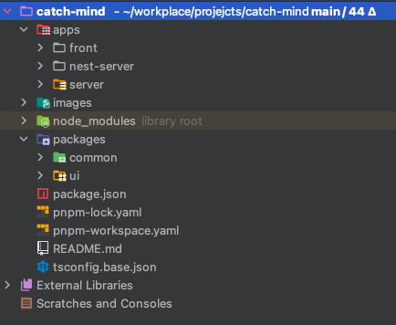

# catch-mind
: react+ts, node 서버 기반 캐치 마인드 개인 프로젝트  
webRTC, socket.io를 사용하여 실시간 채팅, 음성, canvas 통신 기능 구현

- - -

## Directory
pnpm workspac 를 통한 monorepo 구성

### apps
front, node 서버, nest.js 서버(진행중) 위치하며, 각각 독립적인 서비스 위치

- front: 리액트 프로젝트
- server: node.js socket, rest api 서버. 프론트 중심의 프로젝트이기에 아키텍처보다 기능 위주로 간단하게 구현.
- nest-server: (진행중) nest.js 기반의 server. 기존 node 서버의 아키텍처를 개선하기 위해 진행중.

### packages
apps 하위 서비스들이 의존하는 패키지 모음

- ui: apps > front에서 의존하는 ui 컴포넌트 프로젝트. 다른 프론트 프로젝트가 추가되어도 Button, Input 등의 컴포넌트를 공통으로 사용할 수 있도록 세팅.
- common: 프론트, 백엔드 등의 프로젝트 전역에서 사용하는 상수, 함수등의 파일 모음

## IN-GAME 화면
### index 페이지

- 닉네임 입력
- 방만들기, 참여하기 선택: 참여하기 시 전달받은 방 코드를 모달창에 입력
- 서버와의 소켓 연결 (오디오 장치 연결 필수)

### 방설정 페이지
- 게임 설정: 방장만 가능. 소켓 이벤트 연결로 select 옵션 변경 시 참가자 화면에도 실시간 연동
- 유저 목록 노출
- 채팅 기능 구현
- webRTC 연결로 참가자들 간의 음성 연결

### 단어선택

- 술래 플레이어의 단어 선택
: 랜덤 단어의 선택지는 서버에서 정해짐. 

### 그리기중

- 술래의 canvas 화면이 CanvasStream 으로 webRTC 를 통한 참가자간의 비디오 연결됨
- 채팅 화면이 정답 제출을 겸하며, 서버에서 정답 여부 판별
- 정답 제출 시 남은 시간을 고려하여 술래와 정답자에게 점수 부여
- 제한 시간 내 맞추지 못했을 경우, 서버에서 현 게임 세션 종료 후 다음 술래 차례로 진행

### 게임 종료

- 정답 맞춤과 동시에 게임이 모두 끝날 경우 게임 결과 화면 노출

- - -

## 진행 상태: 1차 완료. 에러 처리 및 Nest.js 서버 구축 및 pnpm workspace 구성

- - -

## 프로젝트 환경 구성
### 프론트
react, typescript, vite, chakra-ui, storybook, vitest

### 백엔드
node, express, socket.io

- - -
## 프로젝트 구현 일정

### 프로젝트 1차 구현 (23.11.18 ~ 24.1.1)

- 회원 시스템 없이 진행하며, mesh 아키텍처의 webRTC 성능 고려하여 호스트 + 참가자 총 4인으로 각 게임방 구성
- webRTC 기반의 음성, 캔버스, 채팅 구현
- webRTC 연결 보조를 위한 express + socket 서버 구축
- 게임을 위한 페이지(방선택, 방설정, 게임) 및 chakra-ui 외 추가 컴포넌트 구현
- 프론트 로직 구현(webRTC, socket 통신, 게임 로직)
